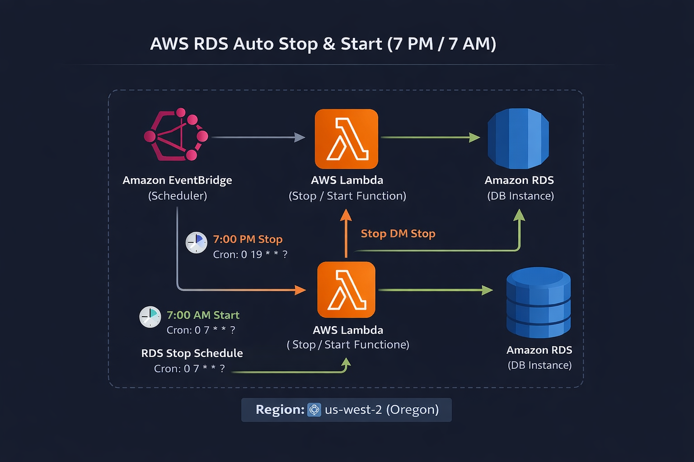

# ⏰ AWS RDS Auto Stop & Start (7 PM / 7 AM) – us-west-2

Automatización para apagar y encender una instancia Amazon RDS utilizando AWS Lambda y Amazon EventBridge.

📍 Región: us-west-2 (Oregon)  
🕒 Horario configurado en UTC (zona por defecto en AWS)

---

## 🎯 Objetivo

- Apagar RDS diariamente a las 7:00 PM
- Encender RDS diariamente a las 7:00 AM
- Optimizar costos en entornos no productivos
- Implementar arquitectura event-driven
- Aplicar principio de mínimo privilegio en IAM

---

## 🏗️ Arquitectura

<p align="center">
  
</p>

# 🧩 Paso 1 – Identificar la Instancia RDS

1. Ir a RDS → Databases
2. Copiar el:
   - DB Instance Identifier
   - ARN completo
   - Región (verificar us-west-2)

Ejemplo de ARN:

arn:aws:rds:us-west-2:ACCOUNT_ID:db:mi-rds-dev

---

# 🧩 Paso 2 – Crear Rol IAM para Lambda

Ir a:

IAM → Roles → Create Role

Seleccionar:
- Trusted Entity: AWS Service
- Service: Lambda

---

## 📌 Crear política personalizada

Adjuntar la siguiente política (reemplazar valores):

```json
{
  "Version": "2012-10-17",
  "Statement": [
    {
      "Effect": "Allow",
      "Action": [
        "rds:StopDBInstance",
        "rds:StartDBInstance"
      ],
      "Resource": "arn:aws:rds:us-west-2:ACCOUNT_ID:db:NOMBRE_RDS"
    }
  ]
}
```
Nombre sugerido del rol:

lambda-rds-start-stop-role

# 🧩 Paso 3 – Crear Función Lambda (Stop RDS)

Ir a:

Lambda → Create function

### Configuración:

- Author from scratch
- Function name: `stop-rds-7pm`
- Runtime: Python 3.12
- Architecture: x86_64
- Execution role: Use existing role → `lambda-rds-start-stop-role`
- Región: us-west-2 (Oregon)

Click en **Create function**

---

## 🔴 Código para Apagar RDS

Reemplazar el código por:

```python
import boto3

rds = boto3.client('rds', region_name='us-west-2')

def lambda_handler(event, context):
    response = rds.stop_db_instance(
        DBInstanceIdentifier='NOMBRE_RDS'
    )
    return {
        "status": "RDS stopping initiated",
        "response": str(response)
    }

```
Click en Deploy

# 🧩 Paso 4 – Crear Función Lambda (Start RDS)

En este paso crearemos la función Lambda encargada de encender la instancia RDS automáticamente todos los días a las 7:00 AM.

---

## 📍 Ir a la Consola AWS

Lambda → Create function

---

## ⚙️ Configuración de la Función

- Author from scratch
- Function name: `start-rds-7am`
- Runtime: Python 3.12
- Architecture: x86_64
- Execution role: Use existing role → `lambda-rds-start-stop-role`
- Región: us-west-2 (Oregon)

Click en **Create function**

---

## 🟢 Código para Encender RDS

Reemplazar el código por el siguiente:

```python
import boto3

rds = boto3.client('rds', region_name='us-west-2')

def lambda_handler(event, context):
    response = rds.start_db_instance(
        DBInstanceIdentifier='NOMBRE_RDS'
    )
    return {
        "status": "RDS starting initiated",
        "response": str(response)
    }
```
Reemplazar NOMBRE_RDS por el identificador real de tu base de datos.

# 🧩 Paso 5 – Crear Regla en EventBridge para Apagar RDS (7:00 PM)

En este paso configuraremos Amazon EventBridge para ejecutar automáticamente la función Lambda que apaga la instancia RDS todos los días a las 7:00 PM en la región us-west-2 (Oregon).

---

## 📍 Ir a la Consola AWS

EventBridge → Rules → Create rule

---

## ⚙️ Configuración General

- Name: `stop-rds-7pm`
- Description: Apaga automáticamente la instancia RDS a las 7 PM
- Event source: Schedule
- Rule type: Schedule

Click en **Next**

---

## ⏰ Configurar Expresión Cron

Seleccionar:

- Schedule pattern → Cron expression

Ingresar:
# 🧩 Paso 5 – Crear Regla en EventBridge para Apagar RDS (7:00 PM)

En este paso configuraremos Amazon EventBridge para ejecutar automáticamente la función Lambda que apaga la instancia RDS todos los días a las 7:00 PM en la región us-west-2 (Oregon).

---

## 📍 Ir a la Consola AWS

EventBridge → Rules → Create rule

---

## ⚙️ Configuración General

- Name: `stop-rds-7pm`
- Description: Apaga automáticamente la instancia RDS a las 7 PM
- Event source: Schedule
- Rule type: Schedule

Click en **Next**

---

## ⏰ Configurar Expresión Cron

Seleccionar:

- Schedule pattern → Cron expression

Ingresar:
cron(0 19 * * ? *)

### 📌 Explicación

| Campo | Valor | Significado |
|--------|--------|------------|
| 0 | Minuto 0 |
| 19 | 19 horas (7 PM) |
| * | Todos los días |
| * | Todos los meses |
| ? | Sin día específico de semana |
| * | Todos los años |

Esto ejecutará la función todos los días a las **19:00 (7 PM)**.

---

## 🎯 Configurar Target

- Target type: AWS service
- Service: Lambda
- Function: `stop-rds-7pm`

Click en **Next**

---

## 🚀 Crear Regla

Revisar configuración y hacer click en:

Create rule

---

## ✅ Validación

1. Ir a EventBridge → Rules
2. Verificar que la regla esté en estado **Enabled**
3. Confirmar que la Lambda asociada sea correcta

---

## 🔐 Buenas Prácticas Aplicadas

- Automatización basada en eventos
- Uso de cron explícito
- Separación de reglas (Start / Stop)
- Optimización de costos en ambientes no productivos

  # 🧩 Paso 6 – Crear Regla en EventBridge para Encender RDS (7:00 AM)

En este paso configuraremos Amazon EventBridge para ejecutar automáticamente la función Lambda que enciende la instancia RDS todos los días a las 7:00 AM en la región us-west-2 (Oregon).

---

## 📍 Ir a la Consola AWS

EventBridge → Rules → Create rule

---

## ⚙️ Configuración General

- Name: `start-rds-7am`
- Description: Enciende automáticamente la instancia RDS a las 7 AM
- Event source: Schedule
- Rule type: Schedule

Click en **Next**

---

## ⏰ Configurar Expresión Cron

Seleccionar:

- Schedule pattern → Cron expression

Ingresar:
# 🧩 Paso 6 – Crear Regla en EventBridge para Encender RDS (7:00 AM)

En este paso configuraremos Amazon EventBridge para ejecutar automáticamente la función Lambda que enciende la instancia RDS todos los días a las 7:00 AM en la región us-west-2 (Oregon).

---

## 📍 Ir a la Consola AWS

EventBridge → Rules → Create rule

---

## ⚙️ Configuración General

- Name: `start-rds-7am`
- Description: Enciende automáticamente la instancia RDS a las 7 AM
- Event source: Schedule
- Rule type: Schedule

Click en **Next**

---

## ⏰ Configurar Expresión Cron

Seleccionar:

- Schedule pattern → Cron expression

Ingresar:
cron(0 7 * * ? *)


### 📌 Explicación

| Campo | Valor | Significado |
|--------|--------|------------|
| 0 | Minuto 0 |
| 7 | 07 horas (7 AM) |
| * | Todos los días |
| * | Todos los meses |
| ? | Sin día específico de semana |
| * | Todos los años |

Esto ejecutará la función todos los días a las **07:00 (7 AM)**.

---

## 🎯 Configurar Target

- Target type: AWS service
- Service: Lambda
- Function: `start-rds-7am`

Click en **Next**

---

## 🚀 Crear Regla

Revisar la configuración y hacer click en:

Create rule

---

## ✅ Validación

1. Ir a EventBridge → Rules
2. Verificar que la regla esté en estado **Enabled**
3. Confirmar que la Lambda asociada sea correcta
4. Revisar logs en CloudWatch después de la ejecución

---

## 🔐 Buenas Prácticas Aplicadas

- Automatización basada en eventos
- Separación clara de responsabilidades (Start / Stop)
